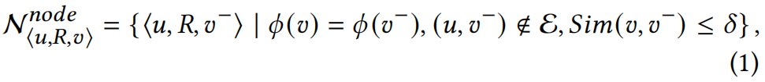
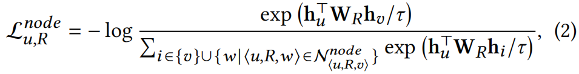
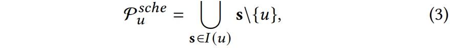
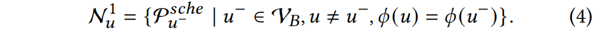
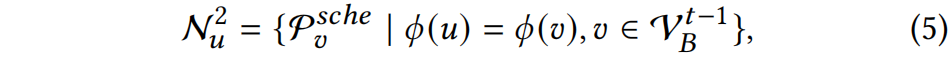
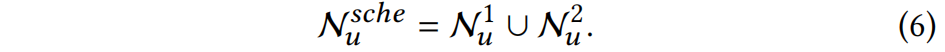
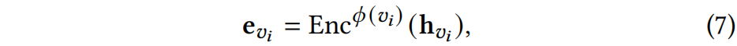
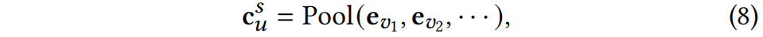
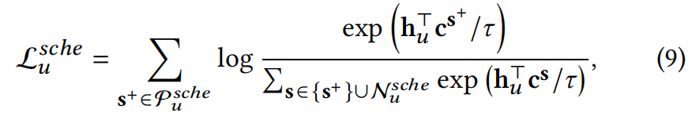

# PT-HGNN
论文笔记&amp;复现：PT-HGNN, 2021, SIGKDD

# 论文笔记

## 简介

本文提出了一种在==大规模异构图==上==预训练==的方法PT-HGNN，采用了node-level和schema-level的pre-training task以==对比学习==的方式学到异构图的语义和结构属性，作为可迁移的知识。此外，提出了一种==基于关系的personalized PageRank==来==稀疏化==大规模异构图。实验的数据集是OAG。

## 方法论

### 预训练任务

我们从node-level和schema-level两个level来生成正样本和负样本，用于对比学习。

#### Node-level Pre-training Task

##### 负样本选取策略

为了防止特征相近的两个结点被选为一对正负样本，提出负样本选取策略为，对于一个正样本$<u,R,v>$，定义负样本为：

即，在边关系$R$下，选取与终点$v$同类型，但与起点$u$不相连的结点$v^-$作为负样本，同时$v$和$v^-$的相似度小于某个值。

##### Node-level Loss

对于给定的正样本$<u,R,v>$，和相应的负样本集合$N^{node}_{<u,R,v>}$，结点$u$的损失函数为：

其中，$W_R$是关系$R$下的可学习矩阵，$h_u$是结点$u$通过GNN学到的表征。

#### Schema-level Pre-training Task

为了利用图中的==高阶语义信息==，使用==network schema==（见论文图1），它的好处是==不需要先验知识==。

##### Positive Network Schema Samples

由于不同结点类型中结点的度会有较大差异，直接在network schema中采样会有==imbalance==问题，为了解决该问题，我们需要控制每一种结点类型的采样数量。

对于一个给定的network schema实例，例如$s = \{ p_1, a_1, f_1, v_1, p_3 \}$，将其中一个结点称为target node，其余结点称为context nodes。因此，对于结点$u$，将其所有context nodes定义为正样本，具体地：

其中，$I(u)$表示含有$u$的所有network schema实例构成的集合。

##### Negative Network Schema Samples

给定一个结点batch $V_B$，其中的结点$u$的负样本定义为：

它的含义是，结点batch中与$u$同类型的结点构成的正样本集合作为$u$的负样本集合。

为了选取更多的负样本，构建了一个==动态队列==来存储network schema instances，具体地：

它的含义是，选取上一个batch中的结点构成的正样本，作为当前batch的结点的负样本。

综上所述，总体的schema-level negative samples为：

##### Encoding Context Nodes and Schema-Level Loss

为每种类型结点定义一个Encoder(MLP)：

对于target node $u$，通过对其context nodes进行Pooling(Mean)，得到$u$的context embedding：

对比损失函数为：

通过对比损失，优化的目标是使得结点$u$与其正样本中的context nodes越接近，与负样本越远。

### Sparsification of Large-Scale Heterogeneous Graph

TODO

